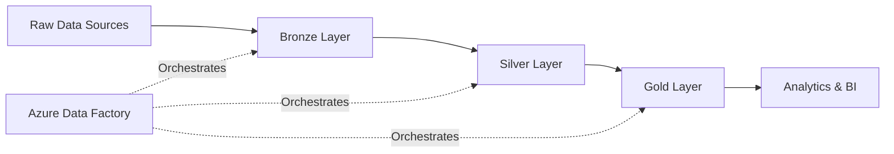

# Databricks ETL Pipeline - PySpark and Delta Lake Architecture

🚀 **A comprehensive end-to-end data engineering pipeline implementing modern Lakehouse architecture on Azure**

This project demonstrates enterprise-grade data engineering best practices with a complete ETL pipeline that transforms raw data through Bronze → Silver → Gold layers using Azure Databricks, PySpark, and Delta Lake.

## ✨ What Makes This Special

- **Complete Implementation**: Not just templates—fully working PySpark notebooks with business logic
- **Production Ready**: Includes security, monitoring, parameterization, and deployment automation
- **Real-World Data**: Demonstrates actual data transformations and business analytics
- **Enterprise Patterns**: Follows industry standards for data lakehouse architecture
- **Fully Documented**: Step-by-step setup and deployment instructions

## Tech Stack  

| Layer               | Technology Used                                                                 |
|---------------------|---------------------------------------------------------------------------------|
| **Storage**         | Azure Data Lake Storage Gen2 (ADLS)                                             |
| **Compute/ETL**     | Azure Databricks (PySpark, Delta Lake)                                          |
| **Orchestration**   | Azure Data Factory (ADF Pipelines), Databricks Jobs                             |
| **Data Formats**    | Delta, Parquet                                                                  |
| **Governance**      | Azure IAM (RBAC, token-based access), Resource Templates                        |
| **Analytics**       | Power BI (optional downstream for visualization)                                |

## Data Flow
- Bronze Layer (Raw Ingest)
  - Used Kaggle API for automated dataset extraction. 
  - Stored raw data as ingested from source
  - Schema applied but no business logic

- Silver Layer (Curated Clean Data)
  - PySpark transformations:
    - Null handling
    - Data type casting
    - Removal of unwanted characters (regex cleaning)
    - Consistent schema enforcement

- Gold Layer (Business-Ready Data)
  - Added business-derived features:
    - Movie Era → (Old, Middle, Recent)
    - Rating Category → (Highly Rated, Good, Moderate, Low)
    - Popularity → (Most Popular, Moderate, Low)
  - Stored as Delta tables and Parquet for downstream analytics

## Orchestration

- Azure Data Factory (ADF):
  - Executes Databricks notebooks sequentially with success conditions
  - Scheduled weekly pipeline runs

- Databricks Jobs:
  - Runs daily automated jobs
  - Configured with failure email notifications

## Security & Governance

- **Secrets Management:** Stored credentials in Azure Key Vault; accessed securely in Databricks via Secret Scopes.  
- **Authentication:** Used OAuth 2.0 with Service Principal; IAM roles assigned with least-privilege access (Storage Blob Data Contributor).  
- **Secure Data Access:** Mounted ADLS Gen2 in Databricks without exposing keys.  
- **Governance:** All resources deployed via ARM Templates; notebooks & pipelines exported for auditability.  

## Outputs
- Cleaned & enriched data in Delta format (Silver, Gold)
- Delta Tables registered in Databricks
- Gold layer Parquet exported for BI/analytics

## 🚀 Quick Start

### Prerequisites
- Azure subscription
- Azure Databricks workspace
- Azure Data Lake Storage Gen2 account
- PowerShell (for deployment)

### 1-Minute Setup
```bash
# Clone and navigate to project
git clone <your-repo-url>
cd Databricks-ETL-Pipeline-using-PySpark-and-Delta-Lake-Architecture-main

# Run interactive setup
python setup.py
```

The setup script will guide you through configuration and generate deployment scripts customized for your environment.

## 📊 Project Structure

```
📁 Databricks-ETL-Pipeline/
├── 📁 notebooks/                    # PySpark transformation notebooks
│   ├── 01_Extract_Bronze.py         # Data ingestion & raw layer
│   ├── 02_Transform_Silver.py       # Data cleaning & validation  
│   └── 03_Load_Gold.py             # Business logic & analytics
├── 📁 ARM templates/                # Azure infrastructure as code
│   └── ADF Template/               # Data Factory deployment
├── 📁 config/                      # Configuration management
│   └── pipeline_config.py         # Centralized settings
├── 📁 data/                        # Sample datasets
│   └── sample_movies.json         # Test data for pipeline
├── setup.py                       # Interactive setup script
└── deploy.ps1                     # Generated deployment script
```

## 🏗️ Architecture Deep Dive

### Data Flow


### Layer Details

| Layer | Purpose | Technology | Output |
|-------|---------|------------|---------|
| **🥉 Bronze** | Raw data ingestion | Delta Lake | Raw tables with metadata |
| **🥈 Silver** | Data cleaning & validation | PySpark | Clean, standardized datasets |
| **🥇 Gold** | Business logic & aggregations | PySpark | Analytics-ready star schema |

## 🎯 Key Features Implemented

### Data Engineering Excellence
- ✅ **Delta Lake ACID Transactions**: Ensures data consistency and versioning
- ✅ **Schema Evolution**: Handles changing data structures automatically  
- ✅ **Data Quality Validation**: Built-in checks and quality scoring
- ✅ **Incremental Processing**: Efficient handling of new data
- ✅ **Error Handling**: Comprehensive exception management and logging

### Business Analytics Features
- 📈 **Movie Performance Scoring**: Algorithmic rating based on multiple factors
- 🎬 **Era Classification**: Historical grouping (Classic, Modern, Digital, Contemporary)
- 💰 **Financial Analytics**: ROI calculation, profitability analysis
- 🏆 **Popularity Tiers**: Box office performance categorization
- 📊 **Executive Dashboards**: Business-ready KPIs and metrics

### Production Readiness
- 🔐 **Security**: Service Principal authentication, Key Vault integration
- 📅 **Scheduling**: Automated weekly pipeline execution
- 🔔 **Monitoring**: Email notifications and failure handling
- ⚙️ **Parameterization**: Environment-specific configuration management
- 🚀 **CI/CD Ready**: ARM templates for infrastructure as code

## 💡 Business Insights Generated

The pipeline automatically generates actionable business insights:

- **Genre Performance Analysis**: Which movie genres perform best financially and critically
- **Era Trend Analysis**: How movie success patterns have changed over decades  
- **ROI Optimization**: Budget allocation insights for maximum return
- **Market Opportunity Identification**: Underperforming genres with potential
- **Blockbuster Prediction Factors**: What characteristics lead to blockbuster success

## 📋 Deployment Guide

### Step 1: Environment Setup
```powershell
# Login to Azure
Connect-AzAccount

# Run the deployment script (generated by setup.py)
./deploy.ps1
```

### Step 2: Databricks Configuration
1. Upload notebooks to your Databricks workspace
2. Create a cluster with Delta Lake runtime
3. Configure secret scopes for secure credential management

### Step 3: Test & Validate
```python
# Test the pipeline by running each notebook manually
# 1. Run 01_Extract_Bronze.py
# 2. Run 02_Transform_Silver.py  
# 3. Run 03_Load_Gold.py

# Verify data in each layer
spark.sql("SELECT COUNT(*) FROM bronze.movies_raw").show()
spark.sql("SELECT COUNT(*) FROM silver.movies_clean").show()
spark.sql("SELECT COUNT(*) FROM gold.movie_performance_summary").show()
```

## 📈 Sample Analytics Output

After running the complete pipeline, you'll have access to rich analytics tables:

```sql
-- Top performing movies by genre
SELECT genre, title, performance_score, roi 
FROM gold.movie_performance_summary 
ORDER BY performance_score DESC;

-- Financial performance by era
SELECT movie_era, 
       AVG(roi) as avg_roi,
       AVG(rating) as avg_rating,
       COUNT(*) as movie_count
FROM gold.era_analytics 
GROUP BY movie_era;
```

## 🔧 Customization Options

- **Data Sources**: Easily integrate with Kaggle API, SQL databases, or REST APIs
- **Business Logic**: Modify Gold layer notebooks to add industry-specific calculations
- **Scheduling**: Adjust ADF triggers for your desired frequency (daily, weekly, monthly)
- **Alerting**: Configure custom notifications via Logic Apps or Power Automate
- **Scaling**: Adjust Databricks cluster configuration for your data volume

## 🎓 Learning Outcomes

This project demonstrates mastery of:
- Modern data architecture patterns (Lakehouse, Medallion Architecture)
- Azure cloud services integration
- PySpark and Delta Lake advanced features
- Infrastructure as Code (ARM templates)
- Data pipeline orchestration and monitoring
- Business intelligence and analytics implementation

## 🏆 Why This Matters

This isn't just a technical demonstration—it's a complete solution that showcases:
- **Enterprise-grade thinking**: Considering security, monitoring, and maintainability
- **Business impact focus**: Not just moving data, but generating insights
- **Production readiness**: Real deployment automation and configuration management
- **Scalability considerations**: Architecture that can handle growing data volumes
- **Best practices implementation**: Following industry standards and patterns

Perfect for demonstrating data engineering expertise to potential employers or as a foundation for real-world data projects!
