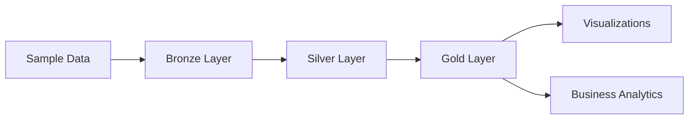

# 🚀 LOCAL DEVELOPMENT SETUP GUIDE

This guide helps you run the Databricks ETL Pipeline locally on your machine for development and testing.

## Prerequisites

### Java Installation (Required for Spark)
1. **Download Java 8 or 11:**
   - Oracle JDK: https://www.oracle.com/java/technologies/downloads/
   - OpenJDK: https://adoptium.net/
   
2. **Set JAVA_HOME environment variable:**
   ```powershell
   # In PowerShell (as Administrator)
   [Environment]::SetEnvironmentVariable("JAVA_HOME", "C:\Program Files\Java\jdk-11.0.x", "Machine")
   ```

3. **Verify Java installation:**
   ```cmd
   java -version
   ```

### Python Dependencies
Run the batch script to install all required packages:
```cmd
install_local_deps.bat
```

Or install manually:
```cmd
pip install -r requirements.txt
```

## Quick Start

### 1. Run Complete Pipeline
Execute the full ETL pipeline locally:
```cmd
python run_local_pipeline.py
```

This will:
- ✅ Generate sample movie data
- ✅ Process Bronze → Silver → Gold layers
- ✅ Create business analytics
- ✅ Generate visualizations
- ✅ Store everything in local Delta tables

### 2. Run Individual Components

**Generate Sample Data:**
```cmd
python local_demo_data.py
```

**Test Spark Configuration:**
```python
from config.local_config import local_config
spark = local_config.get_spark_session()
spark.sql("SELECT 'Hello Local Spark!' as message").show()
```

## Project Structure (Local Mode)

```
📦 Project Root
├── 📁 data/                    # Local Delta Lake storage
│   ├── 📁 bronze/             # Raw ingested data
│   ├── 📁 silver/             # Cleaned & validated data  
│   ├── 📁 gold/               # Business analytics tables
│   ├── 📁 checkpoints/        # Spark streaming checkpoints
│   └── 📁 raw/                # Sample input data
├── 📁 local_visualizations/   # Generated charts & graphs
├── 📁 config/                 # Configuration files
├── 🐍 run_local_pipeline.py   # Main execution script
├── 🐍 local_demo_data.py      # Sample data generator
└── 📄 requirements.txt        # Python dependencies
```

## Data Flow (Local)



## Expected Output

When you run `python run_local_pipeline.py`, you'll see:

```
🚀 DATABRICKS ETL PIPELINE - LOCAL EXECUTION
============================================================
⏰ Started at: 2025-09-29 10:30:00

🔧 Setting up local environment...
✅ Configuration loaded successfully

📦 Preparing sample data...
🎬 Generating sample movie data...
✅ Sample data created:
   📁 JSON: data/raw/movies.json
   📁 CSV: data/raw/movies.csv  
   📊 Records: 20

⚡ Initializing Spark session...
✅ Spark session created successfully

🥉 BRONZE LAYER - Raw Data Ingestion
==================================================
📊 Loaded 20 records from sample data
✅ Bronze data written to: data/bronze/movies

🥈 SILVER LAYER - Data Cleaning & Validation  
==================================================
✅ Silver data written to: data/silver/movies_clean
📊 Cleaned records: 20

🥇 GOLD LAYER - Business Analytics
==================================================
✅ Gold tables created:
   📁 Genre Analysis: data/gold/genre_analysis
   📁 Era Analysis: data/gold/era_analysis
   📁 Top Movies: data/gold/top_movies

📊 BUSINESS INSIGHTS:
🎭 Genre Performance:
[Shows revenue by genre]

🕰️ Era Analysis:  
[Shows trends by era]

🏆 Top 5 Movies by Revenue:
[Shows top performers]

📈 CREATING VISUALIZATIONS
==================================================
✅ Visualizations saved to: local_visualizations/
   📊 genre_revenue.png
   📊 era_ratings.png

🎉 PIPELINE COMPLETED SUCCESSFULLY!
============================================================
⏱️  Total execution time: 12.34 seconds
📁 Data stored in: data/
📊 Layers processed: Bronze → Silver → Gold
✨ Ready for analysis and visualization!
```

## Troubleshooting

### Common Issues

**1. Java Not Found:**
```
ERROR: JAVA_HOME is not set
```
**Solution:** Install Java and set JAVA_HOME environment variable

**2. Memory Issues:**
```
java.lang.OutOfMemoryError
```  
**Solution:** Increase Spark driver memory in `local_config.py`:
```python
.config("spark.driver.memory", "4g")
.config("spark.driver.maxResultSize", "2g")
```

**3. Permission Errors:**
```
PermissionError: [WinError 5] Access is denied
```
**Solution:** Run command prompt as Administrator

**4. Delta Lake Issues:**
```
ClassNotFoundException: delta.sql.DeltaSparkSessionExtension
```
**Solution:** Ensure delta-spark is properly installed:
```cmd
pip install delta-spark==3.0.0
```

### Checking Installation

**Verify Spark:**
```python
from pyspark.sql import SparkSession
spark = SparkSession.builder.appName("test").getOrCreate()
print("Spark version:", spark.version)
```

**Verify Delta Lake:**  
```python
from delta import DeltaTable
print("Delta Lake imported successfully")
```

## Next Steps

After running locally:

1. **Explore the Data:**
   - Check `data/` folder for Delta tables
   - View `local_visualizations/` for charts

2. **Customize the Pipeline:**
   - Modify `local_demo_data.py` for different datasets
   - Update transformations in the pipeline script

3. **Deploy to Azure:**
   - Use the Azure notebooks for cloud deployment
   - Configure Azure resources using ARM templates

4. **Integrate with BI Tools:**
   - Export data using `notebooks/05_Data_Export_Hub.py`
   - Connect Power BI, Tableau, or Excel

## Performance Tips

- **Reduce Logging:** Set `spark.sparkContext.setLogLevel("ERROR")` for cleaner output
- **Partition Data:** For larger datasets, partition by date or category
- **Cache DataFrames:** Use `.cache()` for DataFrames used multiple times
- **Optimize Spark:** Adjust memory settings based on your machine specs

---

**Happy Local Development! 🚀**